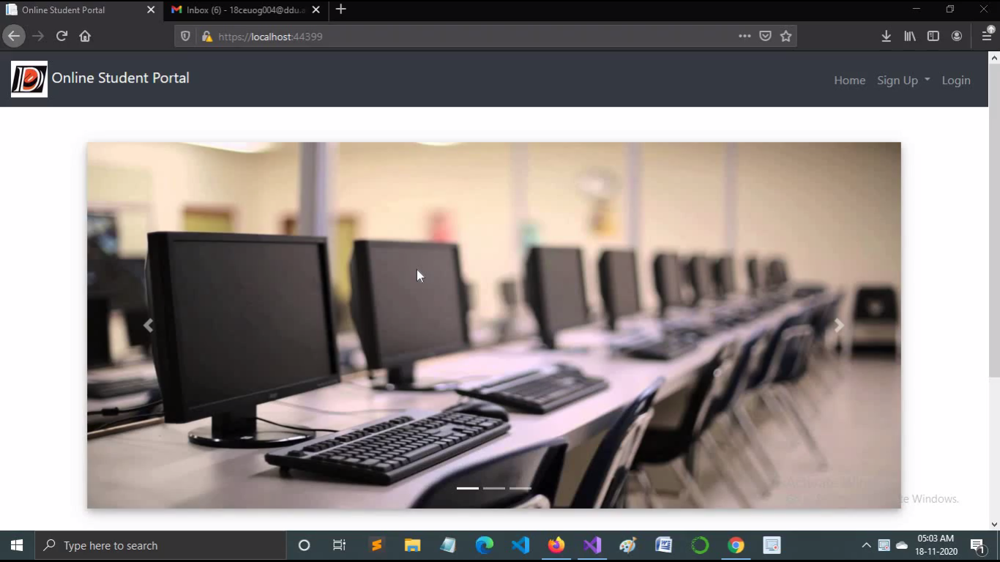
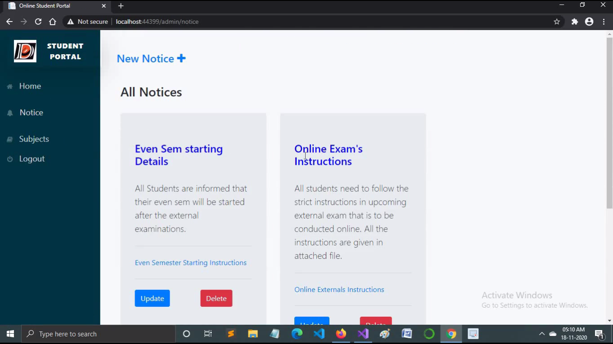
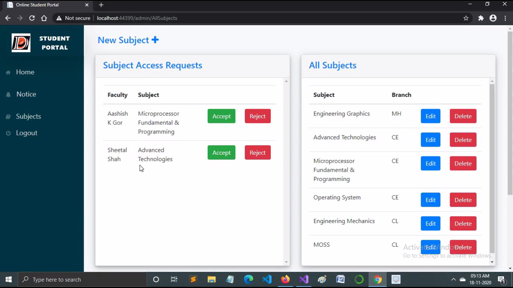
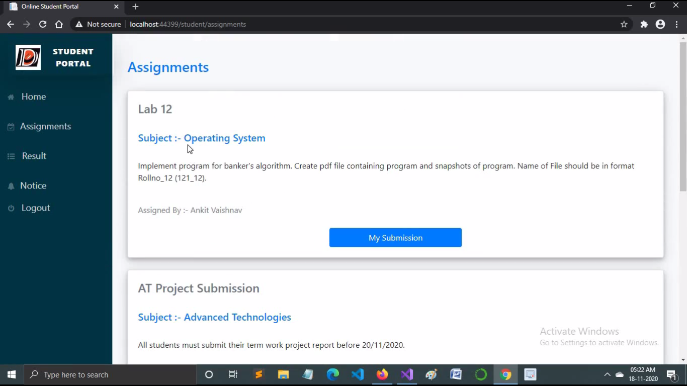
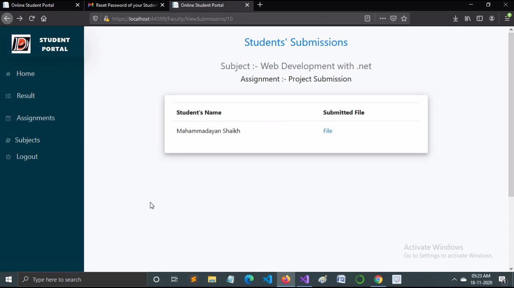
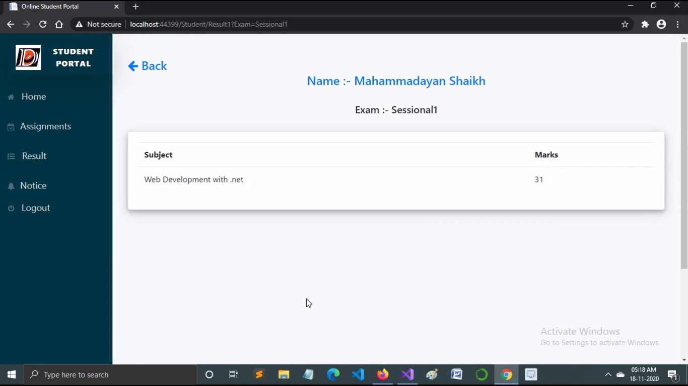

# Online-Student-Portal
This is an Online Student Portal Web application which is developed using asp.net core.This application has 3 types of users :-
1. Admin
2. Faculty
3. Student

## Features :-

* ### Admin's features :-
1. Add/Update/Delete Notice.
2. Create sew subject.
3. Manage Existing subjects.
4. Accept/Reject subject access request sent by faculties.
5. View statistical data of the application.

* ### Faculties' features :-
1. View accessible subjects' list.
2. Send request to admin for getting access of particular subject.
3. Create new Assignment.
4. View submissions submitted by students for a particular assignment.
5. Upload result.
6. Update the result.

* ### Students' features :-
1. View Notices.
2. View exam wise result.
3. View assignment assigned by faculties.
4. Submit file for assignment submission.

## Tools & Technologies used for developing this application :-
1. Asp.net core for full stack web development.
2. SQL server database for storing data of the application.
3. Visual Studio as IDE.

<table>
  <tr>
    <td><td>
    <td><td>
  </tr>
  <tr>
    <td><td>
    <td><td>
  </tr>
  <tr>
    <td><td>
    <td><td>
  </tr>
</table>

